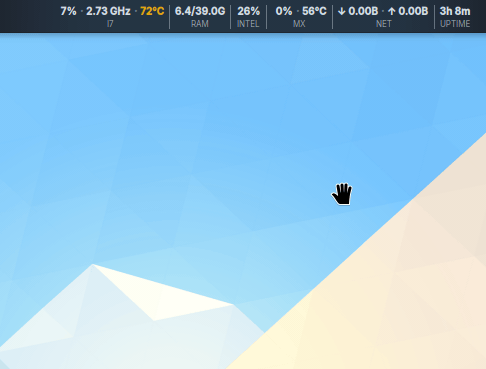

<div align="center">

# KVitals

**Live system stats in your KDE Plasma 6 panel bar: CPU, RAM, GPU, temp, battery, network, and disk.**

[](LICENSE)
[](https://www.opendesktop.org/p/2347917/)
[](https://github.com/yassine20011/kvitals/releases/latest)
[](https://github.com/yassine20011/kvitals/stargazers)

</div>

<div align="center">
  
</div>

---

Most KDE system monitors rely on shell scripts or heavy background programs. They run terminal commands or constantly write to temporary files, which wastes CPU and disk resources just to update a few numbers on your screen.

KVitals reads directly from KDE's built-in sensors instead. Because it doesn't run background scripts, it adds zero overhead to your system. It also only checks the metrics you actually use. If you hide your graphics card in the settings, the widget completely stops asking it for data.

```
CPU: 26% · 3.2GHz  |  RAM: 8.8/39.0G  |  TEMP: 58°C  |  🔋BAT: 78% · 20W  |  NET: ↓82.2K ↑58.9K  |  DSK: ↓1.2MB ↑76KB · 42°C
```

## Features

Here is what you can track and customize:

- **CPU**: Track usage percentage and frequency in a single panel entry with customizable CPU labels.
- **RAM**: View used and total memory, with support for custom RAM labels.
- **Temperature**: Automatic detection of CPU, system motherboard, and RAM temperatures with separate thresholds.
- **GPU**: Monitor usage, VRAM, and temperature. Toggle multiple GPUs independently with custom labels like iGPU or dGPU.
- **Fan speed**: Monitor fan RPM and percentage with stable numbering and individual sparklines.
- **Battery and power**: Automatically detects battery interfaces with an option to display power draw in watts.
- **Network**: Track download and upload speeds, active IP address, and interface auto-detection.
- **Disk I/O and temperature**: Per-drive read/write rates and temperature monitoring with hotplug drive detection.
- **Sparkline charts**: Expanded popup panel displays 60-sample history graphs for all active metrics.
- **Visibility controls**: Choose where each metric appears (panel and popup, panel only, popup only, or disabled).
- **Popup pin mode**: Pin the expanded popup view open while working in other windows.
- **Display modes**: Choose between text, icons, or icons and text, with horizontal or vertical panel layouts.
- **Color customization**: Set font, label, and icon colors, with threshold sliders for warning and critical states.
- **Custom ordering**: Drag and drop metrics to rearrange them.
- **Appearance**: Search system fonts and select icons from your installed theme or bundled fallback icons.
- **Resource efficiency**: Disabling a sensor stops all subscriptions, adding zero background overhead.

## Requirements

- KDE Plasma 6.0 or newer

## Get KVitals

### Install from the KDE Store (recommended)

You can search for KVitals directly in the Plasma widget explorer:

1. Right-click your panel and select **Add Widgets...**
2. Click **Get New Widgets...** and choose **Download New Plasma Widgets...**
3. Search for **KVitals** and select install.

Alternatively, you can visit the [KDE Store listing page](https://www.opendesktop.org/p/2347917/).

### Run the one-liner installer

Run one of these commands in your terminal to fetch and run the installer script:

```bash
# Using curl
curl -fsSL https://github.com/yassine20011/kvitals/releases/latest/download/install-remote.sh | bash

# Using wget
wget -qO- https://github.com/yassine20011/kvitals/releases/latest/download/install-remote.sh | bash
```

### Build manually

If you prefer to build from source:

```bash
git clone https://github.com/yassine20011/kvitals.git
cd kvitals
bash install.sh
```

After the installation completes, restart the Plasma shell and add the widget:

```bash
plasmashell --replace &
```

Right-click the panel, select **Add Widgets...**, search for **KVitals**, and drag it to your panel.

## Customization

Right-click the widget and select **Configure KVitals...** to open the settings dialog.

| Tab         | Available settings                                                                                                                                                                  |
| :---------- | :---------------------------------------------------------------------------------------------------------------------------------------------------------------------------------- |
| **General** | Display modes, layouts (horizontal or vertical), icon dimensions, font styles, refresh intervals, and unit settings (like Fahrenheit or bits per second).                           |
| **Metrics** | Toggle individual sensors, hide them in the main panel, group related readings (like merging CPU and temperature, or battery and power draw), split GPU metrics, and reorder items. |
| **Icons**   | Custom icon selectors mapped to your active theme.                                                                                                                                  |
| **Colors**  | Font, label, and icon colors, threshold levels for warning and critical states, and customizable slider values.                                                                     |

You can find more details on [kvitals.dev](https://kvitals.dev) or in the [local configuration guide](docs/configuration.md).

## Uninstalling

You can remove KVitals through the Plasma Widget Explorer without touching the terminal: right-click your panel, select **Add Widgets...**, and click the uninstall icon next to KVitals.

### Manual / deep cleanup

If you built from source or want to ensure all local files are completely removed, run the following commands:

```bash
rm -rf ~/.local/share/plasma/plasmoids/org.kde.plasma.kvitals
rm -rf ~/.local/share/kpackage/generic/org.kde.plasma.kvitals
plasmashell --replace &
```

## Documentation

Read the local markdown files for deeper details on how to use and modify the widget:

- [Installation guide](docs/installation.md)
- [Configuration options](docs/configuration.md)
- [System architecture](docs/architecture.md)
- [Troubleshooting tips](docs/troubleshooting.md)
- [Contributing guidelines](docs/contributing.md)

Detailed documentation is also hosted at [kvitals.dev](https://kvitals.dev).

## Contributing

I welcome bug reports and pull requests. Please read [CONTRIBUTING.md](CONTRIBUTING.md) before submitting code.

- Open issues or request features on [GitHub Issues](https://github.com/yassine20011/kvitals/issues).
- Start a discussion or ask questions on [GitHub Discussions](https://github.com/yassine20011/kvitals/discussions).

## Contributors

<a href="https://github.com/yassine20011/kvitals/graphs/contributors">
  
</a>

## License and support

KVitals is licensed under the GPL-3.0 license. See the [LICENSE](LICENSE) file for the full text.

If the project helps you, consider giving it a star. If you like my project, you can support me:

[](https://github.com/sponsors/yassine20011)
